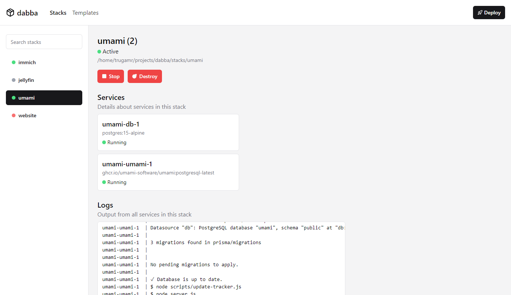

# dabba

Self-hosted dashboard to manage docker compose stacks.

> [!NOTE]
> This project is still in early development, there will be bugs and missing features.

## Building and Running

Before running dabba, you will need to have the following prerequisites installed:

- [Node.js](https://nodejs.org/)
- [pnpm](https://pnpm.io/)

1. Clone the repository using `git clone https://github.com/trugamr/dabba.git`
2. Install dependencies using `pnpm install`
3. Create a `.env` file using the provided `.env.example` file as a template, and fill in your own values.
4. Build the project using `pnpm run build`
5. Start the bot using `pnpm run start`

## Docker Compose

Recommend way to run dabba is using docker-compose:

1. Clone the repository using `git clone https://github.com/trugamr/dabba.git`
2. Copy `.env.example` to `.env` and fill in your own values.
3. Run `docker-compose up -d`

You will now be able to access dabba at `http://localhost:6040`.

## Contributing

If you would like to contribute, you can fork the repository, create a new feature or bugfix branch, and create a pull request.

## License

This project is licensed under the MIT License. See the [LICENSE](LICENSE.md) file for more information.
